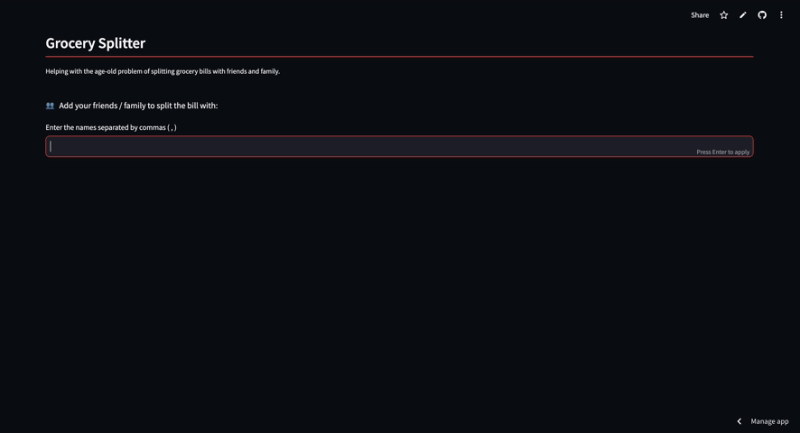

# Grocery Splitter

A simple **Streamlit app** to help you split the grocery bill with your friends and family.
<br/>

<div align="center" style="flex-direction: column;">
  
  <div style="font-size: 0.8em; color: gray;">Demo of the Grocery Splitter app</div>
</div>
<br/>

## 📋 Requirements
To run this project by yourself, you need:
- Python 3.7+

Install the dependencies with:

```bash
pip install -r requirements.txt
```

<br>

## 🖥️ Usage

```shell
# open the streamlit server
streamlit run app.py
```
